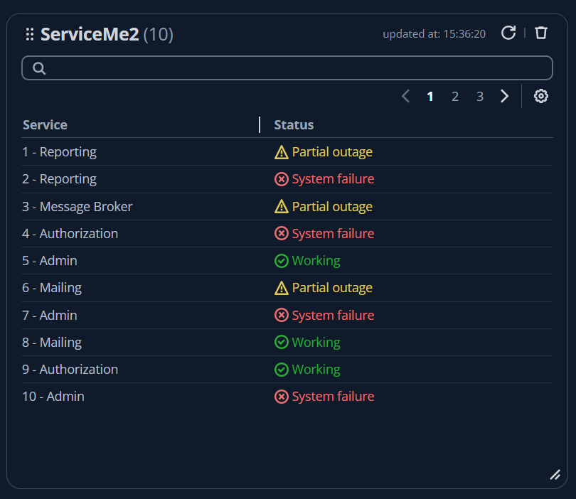
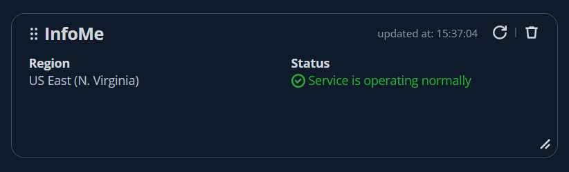

# dassh

Customizable drag and drop dashboard page with widgets. ([demo](https://nichitaa.github.io/pokemon-card-memory-game/))

### When to use ?

- If you need a minimalist but elegant dashboard to visualize your (or not) own real time data (or static)
- Your data can extend and group logically into widgets, and you need the users to pick what widget they are interested with
- You need to parse/modify data, before displaying on the dashboard
- Status pages

### Features

- Ready to use drag and drop dashboard app, just configure your widgets
- Simple to configure widgets (with various types) capabilities
- Provide the data to widgets via JavaScript ✨
  - You can do any integration with any data provider you'd like with your code to retrieve data for the widgets
  - No restrictions with such configurations - if your status service works only with WebSockets and provides data into non-standard format, you can create the WebSocket connection, parse the data as you wish and provide it the widget


### How to use it ?

Edit the file in  [`public/client.js`](./public/client.js), you should provide 2 functions:
- `getBrandDefinition` - set your brand configuration (name)
- `getWidgetsDefinition` - get a list of widget definitions

Documentation for `WidgetDefinition` is in [`src/types/index.ts`](./src/types/index.ts)

To build the app:
```shell
npm run build
```

The `dist` folder can be deployed where you desire. If you need to change/add or remove some widget you can always edit the `client.js` file from the `dist`

### Supported widgets (more to be added)

### Table 


### Simple Info

